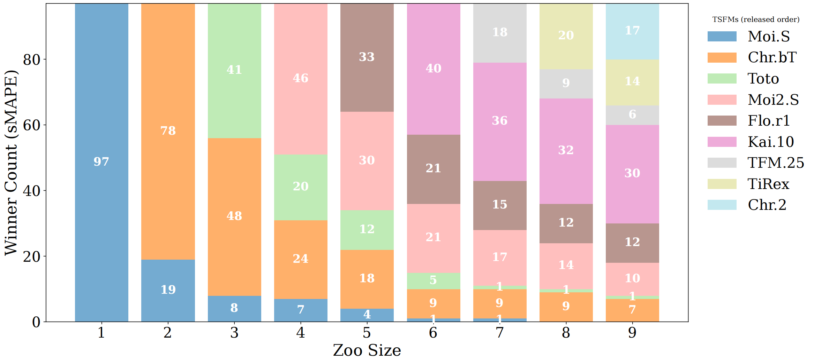

### Table 1. Best-model distribution across domains

This table reports how often each TSFM is the best single model across the 97 GIFT-Eval configurations under `sMAPE` and `MASE`. A more dispersed distribution indicates stronger cross-model complementarity rather than single-model dominance.

| Domain              | Best-model distribution under `sMAPE`                        | Best-model distribution under `MASE`                         |
| :------------------ | :----------------------------------------------------------- | :----------------------------------------------------------- |
| Econ/Fin (n=6)      | Flo.r1(2), TiRex(2), Moi2.S(1), Chr.2(1)                     | TiRex(3), Flo.r1(1), Kai.10(1), Moi2.S(1)                    |
| Energy (n=32)       | Chr.2(11), Kai.10(9), TiRex(5), Moi2.S(2), Flo.r1(2), TFM.25(2), Chr.bT(1) | Chr.2(11), TiRex(9), Flo.r1(4), Moi2.S(3), Chr.bT(2), TFM.25(2), Kai.10(1) |
| Healthcare (n=5)    | Moi2.S(1), Flo.r1(1), Kai.10(1), TiRex(1), Chr.2(1)          | Moi.S(1), Moi2.S(1), Flo.r1(1), TiRex(1), Chr.2(1)           |
| Nature (n=15)       | Kai.10(7), Chr.bT(6), Flo.r1(2)                              | Chr.bT(5), TiRex(5), Chr.2(3), Flo.r1(1), Toto(1)            |
| Sales (n=4)         | Kai.10(2), Flo.r1(1), TiRex(1)                               | Toto(1), Moi2.S(1), Flo.r1(1), TiRex(1)                      |
| Transport (n=15)    | TiRex(5), TFM.25(4), Chr.2(3), Flo.r1(2), Moi2.S(1)          | TiRex(5), TFM.25(4), Chr.2(3), Flo.r1(2), Moi2.S(1)          |
| Web/CloudOps (n=20) | Kai.10(11), Moi2.S(5), Flo.r1(2), Toto(1), Chr.2(1)          | Moi2.S(10), Chr.2(4), Toto(3), Flo.r1(3)                     |
| **ALL (n=97)**      | **Kai.10(30)**, Chr.2(17), TiRex(14), Flo.r1(12), Moi2.S(10), Chr.bT(7), TFM.25(6), Toto(1) | **TiRex(24)**, Chr.2(22), Moi2.S(17), Flo.r1(13), Chr.bT(7), TFM.25(6), Toto(5), Kai.10(2), Moi.S(1) |

To further examine whether this pattern is stable as the zoo expands, the accompanying figure shows the winner-count distribution under `sMAPE` when the zoo size increases gradually in release order. The figure indicates that the non-dominance pattern is not a one-shot artifact of the final zoo composition: as more TSFMs are added, the identity of the winner continues to shift, and the winner counts remain distributed across multiple models rather than collapsing to one persistent dominant TSFM.

Together, the table and figure reveal three clear facts:

1. **No single TSFM dominates the benchmark.**  
   In the full zoo, even the strongest model is best on only 30/97 tasks under `sMAPE` and 24/97 under `MASE`, both well below one third of all configurations. Moreover, the accompanying figure shows that this non-dominance pattern remains stable as the zoo grows: the benchmark does not collapse to a single winner even when more models are introduced.

2. The leading model changes across domains and zoo compositions.  
   In the full-zoo table, `Chr.2` is strongest in `Energy`, `Kai.10` is strongest in `Nature` and `Web/CloudOps` under `sMAPE`, while `TiRex` is strongest in `Transport` and overall under `MASE`. In the growing-zoo figure, the dominant winner also changes repeatedly as newer TSFMs are added. This indicates persistent specialization rather than universal dominance.

3. The identity of the “best” model is itself metric-dependent and benchmark-configuration-dependent.  
   In the full zoo, the overall winner changes from `Kai.10` under `sMAPE` to `TiRex` under `MASE`, and several domains also change their leading model across metrics. The figure further shows that even under a fixed metric (`sMAPE`), the winner structure still evolves as the zoo changes. This is important because the task-specific optimal ranking is not fixed: it depends on both the benchmark setting and the candidate zoo, and recovering it exactly would require exhaustive evaluation of the full zoo.

