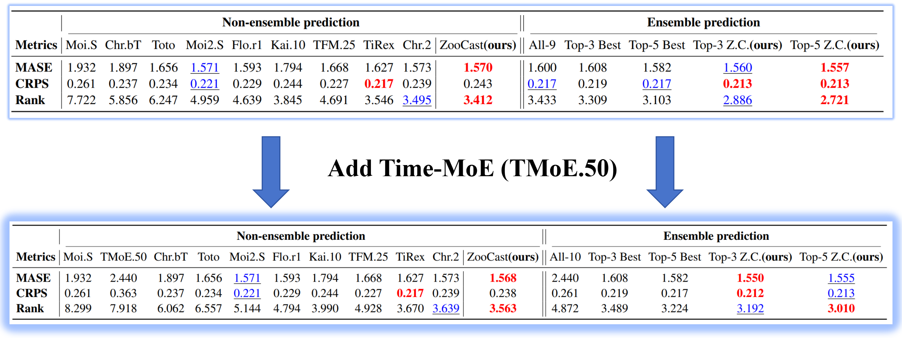

$\underline{\text{Table 11: Additional evidence from adding Time-MoE under a growing zoo}}$

This section examines whether adding one concrete additional TSFM, namely **Time-MoE**, changes the core conclusions about zoo complementarity and dynamic routing under zoo expansion.

### Figure 11(a): Winner-count distribution under sMAPE before and after adding Time-MoE

We compare the winner-count distribution across zoo sizes under the original 9-model zoo and the expanded 10-model zoo after adding **Time-MoE (TMoE.50)** in release order. The x-axis represents zoo size, growing from left to right according to the public release order of the included TSFMs. According to the public Hugging Face release information, Time-MoE was released on 2024.09.21, so in the current zoo it should be regarded as a relatively earlier model.

The figure indicates that the non-dominance pattern is not a one-shot artifact of the final zoo composition: as more TSFMs are added, the identity of the winner continues to shift, and the winner counts remain distributed across multiple models rather than collapsing to one persistent dominant TSFM.

**Main observations**

1. The complementarity pattern remains stable after adding Time-MoE.  
   Before and after the expansion, each TSFM is still best only on a relatively small subset of tasks. We still do not observe one model dominating nearly all configurations. This suggests that model specialization is not an artifact of having omitted one particular model, but remains a stable empirical pattern under zoo growth.

2. **Time-MoE contributes sparse but real new local optima in the current zoo.**  
   After being added into the 10-model zoo, Time-MoE is best on only **4/97** configurations. This indicates that in a growing-zoo setting, the global advantage of earlier models can fade quickly as newer TSFMs continue to appear.

3. **Even sparse new best cases still create room for routing improvement.**  
   Although Time-MoE wins on only a very small number of tasks, these new local optima are still sufficient to provide additional benefit for a dynamic routing method.

---

### Table 11(b): Aggregate performance before and after adding Time-MoE

We report the aggregate results before and after adding **Time-MoE (TMoE.50)** while keeping the evaluation protocol aligned with the main setting of **Table 2** in the paper: aggregated results on GIFT-Eval under zero-shot forecasting. We additionally include **CRPS** here for completeness. **Top-3 Best** denotes a static ensemble formed by the three currently best models under sMAPE. For all metrics, lower is better. Rank is derived by ordering methods using sMAPE on each configuration and then aggregating ranks across configurations. Within each major region, the best result is bolded in red, and the second best is underlined in blue.

**Main observations**

1. **Time-MoE is not globally strong in the current zoo.**  
   Its overall performance is not prominent. In particular, because it is a univariate point-forecasting model, its CRPS is much weaker, while its MASE and Rank are more broadly consistent with the empirical trend already observed in the zoo: newer released models are typically stronger under the current benchmark.

2. **ZooCast still benefits from adding Time-MoE.**  
   Although Time-MoE contributes only a sparse set of newly best tasks, after including it, ZooCast-Top1, Top3, and Top5 all improve slightly but consistently. This shows that by updating the representation library, ZooCast can absorb local gains introduced by newly added models under a growing-zoo setting, even when the added model is not globally competitive.

3. **Fixed Current Best does not improve in this case.**  
   In contrast, a benchmark-derived fixed strongest policy does not change when the newly added model is globally weak, and therefore gains nothing from zoo expansion. This directly illustrates a practically relevant difference between fixed strong policies and dynamic routing under zoo growth.

---

### Takeaway

The Time-MoE experiment serves two purposes simultaneously:

- It directly addresses the zoo-coverage concern by testing a concrete additional TSFM rather than reasoning indirectly.
- It also highlights the central growing-zoo property of ZooCast: even when a newly added model is globally weak but locally useful, dynamic routing can absorb that sparse new benefit, whereas fixed strong policies typically cannot.

---

### Implementation details of Time-MoE

Our implementation of Time-MoE follows the latest official GitHub codebase  
(`https://github.com/Time-MoE/Time-MoE`) and the public Hugging Face model release  
(`https://huggingface.co/AppleDog/TimeMoE-50M/tree/main`).

We use the 50M version, namely TMoE.50, in our experiments. Since the official release does not provide a GIFT-Eval-specific adaptation recipe, our setting for `context_len` strictly follows the latest evaluation configuration in the official `run_eval.py` script. In this sense, the current Time-MoE result should be understood as a faithful implementation under the official public code/model interface, rather than a benchmark-specific tuned variant.